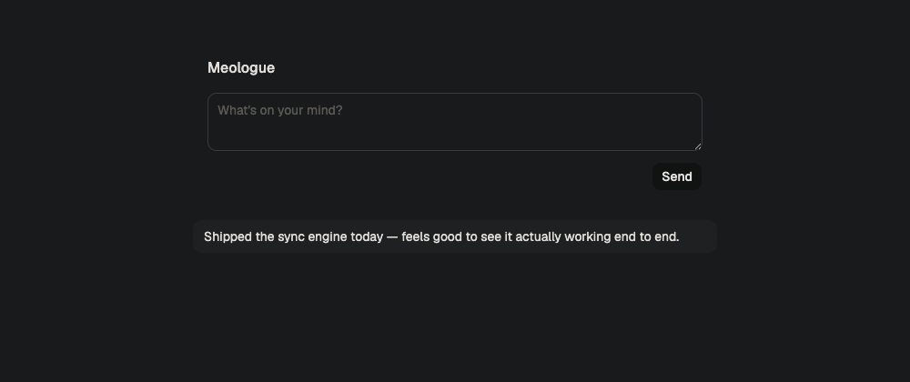

# meologue

A personal log. Type a thought, press Send, and it shows up on your other devices.

Local-first: writes land locally first and sync in the background, so the app stays usable
when the server doesn't. Self-hosted — a single Rust binary and a Postgres container.



## Run it

Needs Node 20+, pnpm, Rust, and Docker.

```bash
pnpm install
docker compose up -d          # Postgres on :5432
```

Then pick **one** of the two workflows below — they both bind `:41207`, so don't run them
at the same time.

### Dev mode (hot reload)

Two long-running processes, each in its **own terminal tab** (`cargo run` blocks, so chaining
the second command after it on the same line never gets to run it):

```bash
# terminal A
cd server && cargo run                # API on :41207, migrations apply on boot
```

```bash
# terminal B
pnpm --filter @meologue/web dev       # app on :5173, proxying /v1 to the server
```

The client only ever uses relative URLs, so it never needs to know the server's address —
Vite proxies `/v1` during development.

### Production-style (single process)

One terminal, no Vite dev server. Build the static app, then let the server serve both the
app and the API on one port:

```bash
pnpm --filter @meologue/web build
cd server && cargo run        # app + API together on :41207
```

That single port is the one to open from another device. The server binds `0.0.0.0`, so a
phone on the same LAN or tailnet can reach it directly.

### Android (debug build via adb)

No emulator, no Android Studio — a debug APK built from the command line and installed on an
attached device. Needs the Android SDK command-line tools (`sdkmanager`, `platform-tools`)
and a JDK; `ANDROID_HOME` and `JAVA_HOME` must be set.

The server address is baked in at build time (`VITE_SERVER_URL`, see ADR 0006) — point it at
your tailnet address, since that's what stays reachable across networks:

```bash
VITE_SERVER_URL=http://<your-tailnet-address>:41207 pnpm --filter @meologue/web build:android
cd apps/web && npx cap sync android   # only needed after changing web code or plugins
cd android && ./gradlew assembleDebug
adb install -r app/build/outputs/apk/debug/app-debug.apk
```

The generated `android/` project is committed as source (its build output is not). If you
change `VITE_SERVER_URL` to a different host, update the exception in
`android/app/src/main/res/xml/network_security_config.xml` — Android blocks cleartext traffic
by default, so the tailnet host needs an explicit exception there.

### macOS

A Tauri v2 shell, buildable with Command Line Tools alone — no Xcode needed. Needs the Tauri
CLI (`cargo install tauri-cli --version "^2"`) in addition to Rust. Build the web app for the
`macos` target with the tailnet address baked in (same `VITE_SERVER_URL` as Android, see ADR
0006), then build and launch the native app:

```bash
VITE_SERVER_URL=http://<your-tailnet-address>:41207 pnpm --filter @meologue/web build:macos
cd apps/web/macos && cargo tauri build --debug
open target/debug/bundle/macos/meologue.app
```

The macOS shell reuses the web `wake-signals` implementation unchanged (`wake-signals.macos.ts`
just re-exports it) — a WKWebView has the same `visibilitychange`/`focus`/`online` events a
browser tab does.

The `apps/web/macos` crate is committed as source (its `target/` build output is not) — Tauri
has no regeneration story, so a fresh checkout without it simply can't build the app. If you
change `VITE_SERVER_URL` to a different host, update `bundle.macOS.exceptionDomain` in
`macos/tauri.conf.json` — macOS's App Transport Security blocks plain-HTTP loads by default, so
the tailnet host needs the same kind of explicit exception Android's
`network_security_config.xml` carves out.

## Layout

```
apps/web       React 19, Vite, Tailwind v4, shadcn/ui — also the source of the Android and macOS shells
apps/web/android  Capacitor's generated Android project (committed as source)
apps/web/macos    Tauri v2 crate for the macOS shell (committed as source)
apps/e2e       Playwright, against the production serving path
packages/core  sync engine and domain types — no React, no DOM
server         Rust, Axum, sqlx, Postgres
```

`packages/core` is deliberately platform-agnostic: it's what the Android and macOS targets
share verbatim. Anything environment-specific — timers, focus events, `fetch` — is injected
into it. There is one Vite application, not one per platform (ADR 0005); where a platform
genuinely differs, the difference lives behind a small build-time seam under
`apps/web/src/platform/`.

## Checks

```bash
pnpm test                                   # unit tests (core + web)
cargo test --manifest-path server/Cargo.toml
pnpm --filter @meologue/e2e test:e2e        # boots the real stack, drives a browser
pnpm lint
```

The TypeScript wire types are generated from the Rust server, which owns the contract:

```bash
pnpm --filter @meologue/core generate:wire-types
```

The generated output is committed, so a fresh checkout doesn't need a Rust toolchain.

## How sync works

One endpoint, `POST /v1/sync`, doing both directions in a single round trip: the client
sends anything unsynced along with its cursor, and gets back everything recorded after it.
Clients poll every few seconds while visible, and on focus and reconnect. No websockets.

Entries are **append-only and immutable** — no edit, no delete — so there are no conflicts
to resolve yet. Ordering for the cursor is a server-assigned sequence; display order is the
client's timestamp, because when you wrote a thought is what you'll care about later.

## Reading further

- `CONTEXT.md` — the glossary. Use these words; the code does.
- `docs/adr/` — why things are the way they are, including the two decisions most likely to
  surprise you: there is no authentication (trust is network-level), and the sync insert
  takes an advisory lock on purpose.

## Not built yet

SQLite and full-text search (the local store is browser-local for now, behind the interface
that SQLite will implement), offline PWA, editing, conflict copies, export, release signing,
app icons beyond the template defaults.
